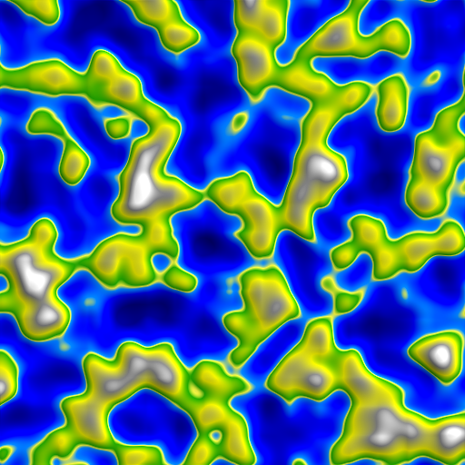
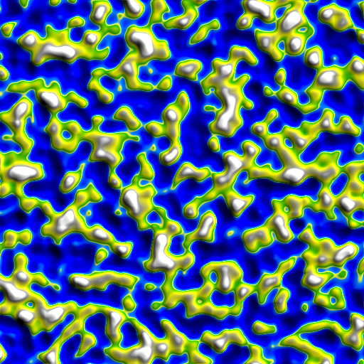

# Noise-CG-2023-1
Imagens do exercício de Coherent Noise

# 4 Imagens vizinhas
### Ordem: Top left, bottom left, top right, bottom right.

# 8 imagens mexendo nas propriedades

### Frequency zerado

### Frequency dobrado

### Octave Count pela metade

### Octave Count dobrado

### Persistence mínimo (0.1)

### Persistence dobrado

### Tudo dobrado

### Tudo triplicado

